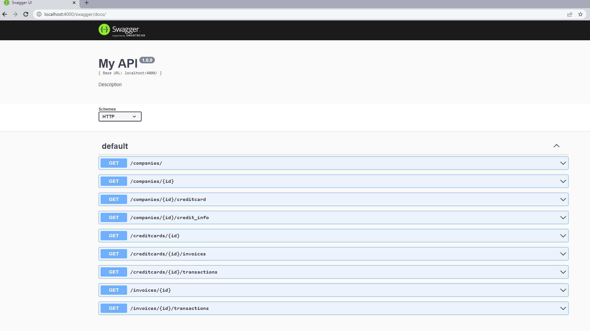

-   **How to run:**

Using docker-compose:
- Tested with Docker Compose version v2.6.0
- You can set the port in the file ```.env``` (By default PORT=4000)

```    -   git clone https://github.com/alaulwan/credit_card_api.git ```

```    -   cd credit_card_api ```

```    -   docker-compose up ```

________________________________________________________________________________
-   **API**

swagger api documentation

<http://localhost:4000/swagger/docs>

<http://localhost:4000/swagger/docs.json>


________________________________________________________________________________
Two docker containers will started:
- credit_card_api_app (the backend api application)
- credit_card_api_db (postgres database). The database will be created and populated by running the initiate file: ```./initiate_sql/init.sql```
